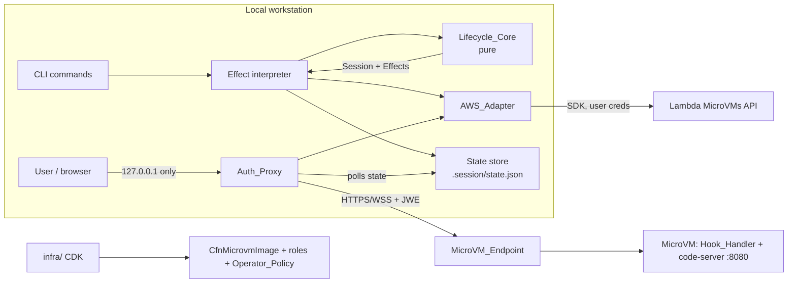
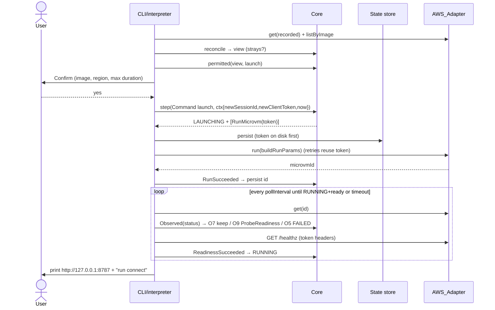
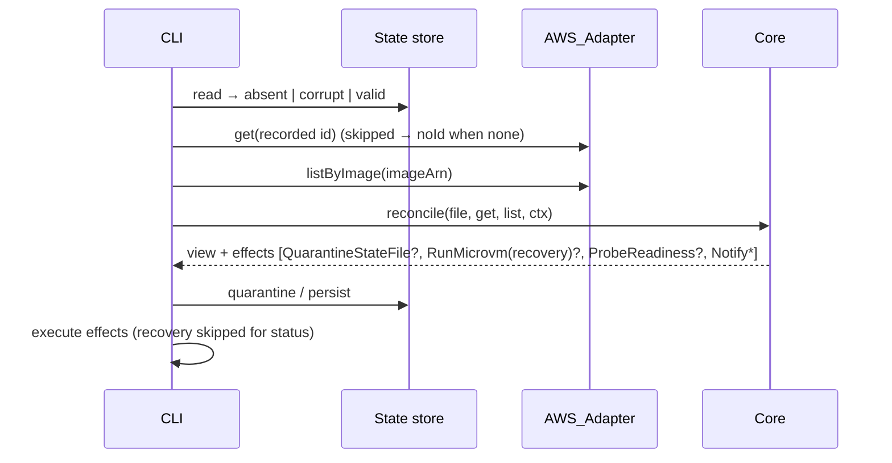

# Design Document: lambda-microvm-code-server

## Overview

A local TypeScript CLI runs code-server in exactly one AWS Lambda MicroVM. It uses the user's short-lived credentials and has no deployed control plane. The design separates two layers:

- Pure core (`src/core/`). Holds the Session model, one explicit transition table, the Reconciler, config validation, the retry delay policy, and RunMicrovm parameter building. The clock, ID generator, and randomness are injected. Every lifecycle decision comes back as data: a new Session plus a list of effect descriptors.
- I/O shell (`src/shell/`, `src/cli/`). Holds the AWS_Adapter, the State_File store, the Auth_Proxy, the readiness probe, prompts, and the effect interpreter. The shell never decides a transition. It only runs the effects the core returns and feeds the results back as events.

Persistent infrastructure lives in `infra/` (CDK). It contains the build-context asset, the Image_Build_Role, `CfnMicrovmImage`, and the Operator_Policy. The image sources live in `image/`.

Facts about AWS behavior come from the requirements "Assumptions and Open Questions" section. This design does not repeat that research. Items that are not Verified are scheduled in the Phase 0 spike (section 11). Each one has a stated fallback.

### Resolutions of Open Questions (recommended, overridable)

| ID | Resolution | Override |
|---|---|---|
| Q-1 | Resolved (user-confirmed), enabled by default. The Auth_Proxy requires a per-connect secret. `connect` prints a one-time login URL (`/__csmvm/login?k=<secret>`). The first use swaps the secret for an `HttpOnly; SameSite=Strict` session cookie and then invalidates it. The proxy also checks the `Host` and `Origin` headers. | `proxy.localAuth: false` brings back the plain localhost behavior. A warning is printed. |
| Q-2 | Resolved (user-confirmed): Region `ap-northeast-1`. Region and Image ARN live in `csmvm.config.json` (gitignored). The `config import` subcommand fills them from `infra/cdk-outputs.json` (`cdk deploy --outputs-file`). | Edit the config file by hand. |
| Q-3 | Resolved (user-confirmed): pass no network connectors by default and rely on the service defaults (outbound internet works by default). S2 checks whether the ingress connector (`ALL_INGRESS`) must be passed for the endpoint; if so, the default becomes the ingress connector only. | Optional config `networkConnectorArns` (passed exactly as configured). |
| Q-4 | No Execution_Role. RunMicrovm is called without `executionRoleArn` unless Phase 0 shows it is required. | CDK context `withExecutionRole=true` adds the role and an `iam:PassRole` statement. The CLI reads `executionRoleArn` from config. |
| Q-5 | The workspace starts empty. code-server opens `/home/coder/workspace`, an empty directory. | Add files under `image/workspace-seed/`. |
| Q-6 | Resolved (user-confirmed): the Auth_Proxy runs only in the foreground of `connect`. `launch` and `resume` print the proxy URL and the `connect` hint. `launch` never starts the proxy. | — |

## Architecture



### Repository layout

```
package.json, pnpm-workspace.yaml, pnpm-lock.yaml, vite.config.ts, flake.nix
.gitignore, .gitleaks.toml, .vite-hooks/pre-commit, csmvm.config.example.json
src/core/      session.ts, transitions.ts, reconcile.ts, status-map.ts,
               config.ts, retry.ts, run-params.ts   (no fs/net/process/AWS imports)
src/shell/     aws-adapter.ts, state-store.ts, readiness.ts, proxy/*, redact.ts, prompt.ts
src/cli/       main.ts, commands/{launch,status,connect,suspend,resume,terminate,config}.ts,
               interpreter.ts
image/         Dockerfile, entrypoint.sh, hooks/ (TS hook handler), workspace-seed/ (empty)
infra/         bin/app.ts, lib/stack.ts, test/stack.test.ts   (separate pnpm workspace package)
test/          core/*.property.test.ts, cli/*.test.ts, proxy/*.test.ts, fakes/fake-microvms.ts
docs/          ENV-CHECKLIST.md, phase0-findings.md
```

The import boundary is enforced by the Oxlint `no-restricted-imports` rule (configured through Vite+'s `lint` section) on `src/core/**`. It bans `@aws-sdk/*`, `node:fs`, `node:net`, `node:http(s)`, `node:process`, and `node:child_process`. An import-scan test adds a second, tool-independent check and is the authoritative boundary guard if Oxlint cannot express the rule (R16.4).

## Components and Interfaces

### Lifecycle_Core (pure)

```ts
type SessionState =
  | "NONE" | "LAUNCHING" | "RUNNING" | "SUSPENDING" | "SUSPENDED"
  | "RESUMING" | "TERMINATING" | "TERMINATED" | "FAILED";
const REMOTE_BACKED = ["RUNNING","SUSPENDING","SUSPENDED","TERMINATING","TERMINATED"] as const; // R1.1
const LOCAL_ONLY = ["NONE","LAUNCHING","RESUMING","FAILED"] as const;

type RemoteStatus = "PENDING"|"RUNNING"|"SUSPENDING"|"SUSPENDED"|"TERMINATING"|"TERMINATED";

interface Session {
  sessionId: string | null;          // null iff state === "NONE"
  microvmId: string | null;          // set at most once per sessionId (R3.1)
  state: SessionState;
  adopted: boolean;
  launchClientToken: string | null;  // non-null only while LAUNCHING, or TERMINATING with microvmId null (C6, R9.7)
  inFlightSince: number | null;      // epoch ms, non-null only in In_Flight_States
  lastReconciledAt: number | null;
  rawRemoteStatus: string | null;    // last raw value, incl. unrecognized
  region: string;
}

interface Ctx {                      // injected; makes every core function pure
  now: number;
  newSessionId: string;              // pre-generated by shell (crypto.randomUUID)
  newClientToken: string;            // 1..128 chars (A-11)
  timeouts: { launchMs: number; suspendMs: number; resumeMs: number };
}

type Command = "launch" | "suspend" | "resume" | "terminate";

type Event =
  | { type: "Command"; cmd: Command }
  | { type: "RunSucceeded"; microvmId: string }
  | { type: "RunFailed"; error: AwsErrorInfo }        // after adapter retries
  | { type: "MutationFailed"; op: "suspend"|"resume"|"terminate"; error: AwsErrorInfo }
  | { type: "Observed"; remote: RemoteObs }
  | { type: "ReadinessSucceeded" };

type RemoteObs =
  | { kind: "status"; raw: string }   // from GetMicrovm
  | { kind: "notFound" }              // ResourceNotFoundException (A-2)
  | { kind: "noId" };                 // nothing to query yet

type Effect =
  | { kind: "RunMicrovm"; clientToken: string; sessionId: string }   // params built by buildRunParams
  | { kind: "SuspendMicrovm"; microvmId: string }
  | { kind: "ResumeMicrovm"; microvmId: string }
  | { kind: "TerminateMicrovm"; microvmId: string }
  | { kind: "ProbeReadiness"; microvmId: string }
  | { kind: "Reconcile" }                                // GetMicrovm, then Observed
  | { kind: "QuarantineStateFile" }                      // R9.5
  | { kind: "Notify"; code: NoticeCode; detail?: Record<string, string> };

const MUTATING = new Set(["RunMicrovm","SuspendMicrovm","ResumeMicrovm","TerminateMicrovm"]);

interface View { session: Session; strays: { microvmId: string; status: string }[] }

type StepResult =
  | { ok: true; session: Session; effects: Effect[] }
  | { ok: false; rejection: { state: SessionState; cmd: Command; code: "not_permitted" | "strays_present" | "already_terminated" }; session: Session; effects: [] };

function mapRemoteStatus(raw: string): { state: SessionState; raw: string };   // R1.7, total
function permitted(view: View, cmd: Command): boolean;           // same guards as step, no state change
function step(view: View, ev: Event, ctx: Ctx): StepResult;
function reconcile(input: ReconcileInput, ctx: Ctx): { view: View; effects: Effect[] };
```

`permitted` is a pure pre-check. The shell calls it before it shows a Confirmation_Prompt, so the user is never asked about a command the core would reject.

### Reconciler

```ts
type FileRead = { kind: "absent" } | { kind: "corrupt" } | { kind: "valid"; session: Session };
interface ReconcileInput {
  file: FileRead;
  get: RemoteObs;                                   // GetMicrovm(recorded id)
  list: { microvmId: string; status: string }[];    // ListMicrovms(imageIdentifier = project Image ARN)
}
```

The algorithm is pure and deterministic:

1. If the file is `corrupt`, emit `QuarantineStateFile` and `Notify(corrupt_state)` and continue as if it were `absent` (R9.5).
2. Active list `A` = the list entries whose status is not `TERMINATED`.
3. If the file is absent: when `|A| = 1`, adopt it as a new Session with `ctx.newSessionId`, the entry's ID, the mapped state, and `adopted = true`. When `|A| ≥ 2`, the session is `NONE` and `strays = A` (R9.4). When `|A| = 0`, the session is `NONE`.
4. If the file is valid, apply `step(view, {type:"Observed", remote:get})` using the observation rows of the transition table. Then `strays = A` without `session.microvmId` (R3.4).
5. If the result is `LAUNCHING` with a token and no `microvmId`, emit `RunMicrovm(persisted token)` as interrupted-launch recovery (R12.6).
6. Set `lastReconciledAt = ctx.now`.

The interpreter runs recovery effects for every command except `status`. `status` only reports `Notify(launch_recovery_pending)`. A read-only command should not make mutating calls.

### Transition table (single source of truth)

`id` means `session.microvmId`. `since` means `inFlightSince`. `T(state)` means the In_Flight_Timeout for that state has expired (`ctx.now − since ≥ timeout`). `M(raw)` means `mapRemoteStatus(raw).state`. Any row that changes `state` also sets `rawRemoteStatus` from the observation. It sets `since = now` when it enters an In_Flight_State and clears `since` when it leaves one. Pairs not listed in the user-command rows are rejected with `not_permitted` (R1.3).

User commands:

| # | From | Event | Guard | To | Effects |
|---|---|---|---|---|---|
| C1 | NONE, TERMINATED | launch | `strays = ∅` | LAUNCHING: new `sessionId = ctx.newSessionId`, `id = null`, token = `ctx.newClientToken`, `adopted = false` | RunMicrovm(token, sessionId) |
| C2 | NONE, TERMINATED | launch | `strays ≠ ∅` | reject `strays_present` | — |
| C3 | RUNNING | suspend | — | SUSPENDING | SuspendMicrovm(id) |
| C4 | SUSPENDED | resume | — | RESUMING | ResumeMicrovm(id) |
| C5 | LAUNCHING, RUNNING, SUSPENDING, SUSPENDED, RESUMING, FAILED | terminate | `id ≠ null` | TERMINATING | TerminateMicrovm(id) |
| C6 | LAUNCHING | terminate | `id = null` | TERMINATING (token kept) | RunMicrovm(token) to obtain the ID first (R12.6) |
| C7 | TERMINATING | terminate | `id ≠ null` | TERMINATING (self-loop, re-issue) | TerminateMicrovm(id) |
| C7b | TERMINATING | terminate | `id = null` | TERMINATING (self-loop, token kept) | RunMicrovm(token) to recover the ID (R8.8, R12.6) |
| C8 | TERMINATED | terminate | — | reject `already_terminated` (CLI exits 0, R8.4) | — |

Adapter results:

| # | From | Event | Guard | To | Effects |
|---|---|---|---|---|---|
| E1 | LAUNCHING | RunSucceeded(m) | `id = null` | LAUNCHING, `id = m` | — (the wait loop starts) |
| E2 | TERMINATING | RunSucceeded(m) | `id = null` | TERMINATING, `id = m`, token cleared | TerminateMicrovm(m) |
| E3 | LAUNCHING, TERMINATING | RunFailed(non-retryable) | `id = null` | NONE (session discarded) | Notify(run_failed) (R2.6) |
| E4 | LAUNCHING, TERMINATING | RunFailed(retryable exhausted, or outcome unknown: network/transport error or client timeout) | `id = null` | unchanged, token kept | Notify(launch_recoverable) |
| E5 | SUSPENDING | MutationFailed(suspend) | — | RUNNING | Reconcile, Notify (R6.5) |
| E6 | RESUMING | MutationFailed(resume) | — | SUSPENDED | Reconcile, Notify (R7.6) |
| E7 | TERMINATING | MutationFailed(terminate, retryable) | — | TERMINATING | Notify(terminate_retryable) (R8.5) |
| E8 | TERMINATING | MutationFailed(terminate, other) | — | TERMINATING | Reconcile, Notify |
| E9 | LAUNCHING, RESUMING | ReadinessSucceeded | last raw = `RUNNING` | RUNNING, token cleared | Notify(ready) |

Any event not listed above (for example a stale RunSucceeded when `id ≠ null`) leaves the Session unchanged and emits nothing. That keeps R3.1 safe even if events arrive in an unexpected order.

Observations (`Observed`), evaluated top to bottom, first match wins:

| # | From | Observation | To | Effects | Req |
|---|---|---|---|---|---|
| O1 | TERMINATED | any | TERMINATED (terminal) | — | — |
| O2 | TERMINATING, FAILED | `TERMINATED` or notFound | TERMINATED | — | R8.2, R9.12 |
| O3 | TERMINATING, FAILED | anything else (incl. unrecognized) | unchanged, raw recorded | — | R9.12 |
| O4 | LAUNCHING | noId | LAUNCHING | — (the reconciler adds recovery) | R9.9, R12.6 |
| O5 | LAUNCHING, RESUMING | any, with `T(state)` | FAILED | Notify(timeout, lastRaw) | R2.7, R9.11 |
| O6 | LAUNCHING, RESUMING | `TERMINATING`, `TERMINATED`, or notFound after the eventual-consistency grace (below) | FAILED | Notify | R9.11 |
| O7 | LAUNCHING | `PENDING`, or notFound within the grace | LAUNCHING | — | R9.9 |
| O8 | RESUMING | `SUSPENDED` | RESUMING | — | R9.9 |
| O9 | LAUNCHING, RESUMING | `RUNNING` | unchanged | ProbeReadiness(id) | R9.10 |
| O10 | SUSPENDING | `RUNNING` and not `T` | SUSPENDING | — | R9.9 |
| O11 | any | unrecognized raw | FAILED, raw preserved | Notify(unknown_status) | R1.7, R1.8 |
| O12 | any other | notFound | TERMINATED | — | A-2 |
| O13 | any other | recognized raw | `M(raw)` | Notify(state_adopted) if changed | R9.2 |

The notFound grace is `min(launch timeout, 30 s)` from `since`. For LAUNCHING, notFound within the grace is treated as "ID not yet returned" (R9.9). After the grace, a recorded ID that is not found counts as terminated, so O6 fires. Phase 0 (A-2) tunes the value.

O4 precedes O5 on purpose: a LAUNCHING session with no recorded ID never times out to FAILED (R2.7 applies only with an ID recorded). It is resolved by the recovery RunMicrovm through E1, E3, or E4, so FAILED always has an ID that C5 can terminate.

The only rows that lead to FAILED are O5 and O6 (sources LAUNCHING and RESUMING) and O11 (unrecognized status), which satisfies R1.8. Only C1 and adoption create a `sessionId`. Only E1 and E2 set `id`, and both require `id = null`. Together these give R3.1 and R3.3.

### Pure helpers

```ts
// R4.10, R11.1, R11.2: validated before any AWS call
function validateConfig(raw: unknown): { ok: true; config: CliConfig } | { ok: false; errors: ConfigError[] };

// R2.1, R2.5, R2.8, R2.9
function buildRunParams(cfg: CliConfig, clientToken: string, sessionId: string): RunMicrovmParams;
//  maximumDurationInSeconds = cfg.maximumDurationInSeconds
//  idlePolicy = { autoResumeEnabled: false,
//                 maxIdleDurationSeconds: max(60, cfg.maximumDurationInSeconds),
//                 suspendedDurationSeconds: cfg.suspendedDurationSeconds }   // all three fields set (A-6, A-15)
//  networkConnectors: omitted unless cfg.networkConnectorArns is set, then passed exactly (R2.8);
//                     if S2 shows ALL_INGRESS is required, the default becomes [ingress only]
//  runHookPayload = JSON.stringify({ sessionId })  -- asserted <= 4096 bytes, no secrets

// R12.1, R12.2: full jitter
function retryDelayMs(attempt: number, p: { baseMs: number; capMs: number }, rand01: number): number;
//  upper(attempt) = min(capMs, baseMs * 2 ** attempt);  delay = floor(rand01 * upper(attempt))
```

If Phase 0 finds an upper bound `B < 28800` on `maxIdleDurationSeconds` (A-6), `validateConfig` caps `maximumDurationInSeconds` at `B`. The requirements are amended accordingly (section 11).

`suspendedDurationSeconds` defaults to the resolved `maximumDurationInSeconds`. Until S8 reports (A-15), `validateConfig` accepts an integer in `[1, 28800]`; this upper bound is unverified and is tightened if S8 finds a narrower range.

### AWS_Adapter (shell)

```ts
interface MicrovmsPort {               // the CLI depends on this; tests inject FakeMicrovms
  run(p: RunMicrovmParams): Promise<{ microvmId: string }>;
  get(id: string): Promise<RemoteObs & { endpoint?: string; remainingSeconds?: number }>;
  listByImage(imageArn: string): Promise<{ microvmId: string; status: string }[]>;
  suspend(id: string): Promise<void>;
  resume(id: string): Promise<void>;
  terminate(id: string): Promise<void>;
  createAuthToken(id: string, port: number, minutes: number): Promise<{ token: string; expiresAt: number }>;
}
```

- The client is `@aws-sdk/client-lambda-microvms` at a pinned version. The SDK's own retries are turned off (`maxAttempts: 1`) so the project's policy is the only retry layer (R12.1). Credentials come only from the default provider chain (R15.4).
- `withRetry(op)` retries only `ThrottlingException` and `InternalServerException`. It uses `retryDelayMs` with `Math.random` injected at the edge. All other errors are returned unchanged (R12.3).
- `run` passes the same `clientToken` on every retry (R12.4).
- `get` turns `ResourceNotFoundException` into `{kind: "notFound"}`.
- `listByImage` follows pagination to the end.
- The token's `expiresAt` is computed conservatively as `requestStart + minutes·60s` unless the API response gives an expiry.
- Field names for the endpoint and remaining duration in GetMicrovm output are confirmed in Phase 0.

### State store (shell)

- Path: `.session/state.json`. The directory mode is `0700` and the file mode is `0600`.
- Writes are atomic: `writeFile(tmp in same dir) → fsync → rename` (R9.6).
- Reads return a `FileRead`. If JSON parsing or schema validation fails, the result is `corrupt`.
- `quarantine()` renames the file to `state.json.corrupt-<ISO timestamp>`.
- The schema is a zod schema in the shell. It converts to and from the core `Session` type, so the core stays free of dependencies.

### Effect interpreter (shell)

```
runCommand(cmd):
  cfg  = validateConfig(load())                         // fail fast, zero AWS calls
  view = reconcile(read + get + list) → execute effects (recovery skipped for status)
  if !permitted(view, cmd): print rejection; exit 2 (exit 0 for already_terminated)
  if cmd ∈ {launch, terminate}: confirm()               // R10; decline → exit 0, zero calls
  res = step(view, Command(cmd), ctx)
  persist(res.session)                                  // always BEFORE executing effects
  for e in res.effects: result = exec(e); feed result event → step → persist
  waitLoop(target) for launch/suspend/resume/terminate: poll get every pollInterval,
      feed Observed / ReadinessSucceeded until the session leaves the In_Flight_State or times out
```

Persisting before execution makes sure that the Launch_Client_Token (R12.4) and the In_Flight_State are on disk before any mutating call. Ctrl-C during `waitLoop` is safe. The next command reconciles.

### Auth_Proxy (shell, foreground in `connect`)

```ts
interface ProxyDeps {
  port: MicrovmsPort; microvmId: string; endpoint: string; codeServerPort: number;
  readState(): Promise<SessionState>;        // polls State_File every 1 s
  clock(): number; log: RedactingLogger;
  cfg: { listenPort: number; maxTokenMinutes: number; refreshMarginS: number; localAuth: boolean };
}
```

- Listening: the proxy binds `127.0.0.1:<listenPort>` only (R4.1). A port that is already in use is an error with exit code 1.
- Local auth (Q-1): a 256-bit secret is printed once, as `http://127.0.0.1:<port>/__csmvm/login?k=<secret>`. Using it sets the cookie `__csmvm` (`HttpOnly; SameSite=Strict; Path=/`) whose value is a separate, freshly generated 256-bit random value held only in memory, invalidates the secret, and redirects to `/`. The secret and the cookie value are compared in constant time (`crypto.timingSafeEqual`). Requests without a valid cookie get 401. Every request must have `Host` equal to `127.0.0.1:<port>` or `localhost:<port>`, which blocks DNS rebinding. WebSocket upgrades also require the `Origin` to match. The `__csmvm` cookie is stripped before the request goes upstream.
- HTTP forwarding: the proxy forwards to `https://<endpoint>` and adds `X-aws-proxy-auth: <token>` and `X-aws-proxy-port: <codeServerPort>` (R4.2). Hop-by-hop headers are stripped.
- WebSocket: the browser socket is terminated at the proxy. An upstream socket is opened with the subprotocols `lambda-microvms`, `lambda-microvms.authentication.<token>`, and `lambda-microvms.port.<p>`. Frames are relayed both ways using the `ws` library (R4.3). The upstream's `Sec-WebSocket-Protocol` is never echoed to the browser.
- Token cache: one token is held in memory. Single-flight refresh runs when `expiresAt − now < refreshMargin` (R4.6). Each token is requested with `allowedPorts = [{port: codeServerPort}]` and the configured expiry (R4.7). If refresh fails, the browser gets 502 with a generic body and the terminal gets the error name (R4.8).
- State gating: if the polled state is not `RUNNING`, the browser gets 503 with `{"state": "<state>"}` and open WebSockets are closed (R4.9, R6.4). If the state is `TERMINATING` or `TERMINATED`, the proxy closes its listener and `connect` exits 0 (R8.6). After a resume, browsers reconnect on their own (A-10).
- Redaction (R4.4): every log line passes through `redact()`, which masks the current and previous token values and any string that looks like a JWE (five base64url segments). `X-aws-proxy-auth` is removed from response headers, and upstream error bodies are never relayed verbatim.

### Readiness probe (shell)

`GET https://<endpoint>/healthz` with the token headers and a 5 s timeout. Any 2xx response emits `ReadinessSucceeded` (R2.4, R7.2).

### CLI commands

| Command | Notes |
|---|---|
| `launch [--yes]` | The prompt shows the Image ARN, Region, and max duration (R10.1). Waits for RUNNING, then prints `http://127.0.0.1:<port>` and the `connect` hint. |
| `status` | Prints sessionId, microvmId, state, raw status, adopted, remaining duration if known, strays, and the snapshot-cost notice when SUSPENDED (R9.8, R11.3). Never mutates anything. |
| `connect` | Requires RUNNING. Runs the Auth_Proxy in the foreground. |
| `suspend`, `resume` | Wait for the target state. |
| `terminate [--yes] [--stray <id>]` | The prompt names the MicroVM ID and warns about state loss (R10.2). `--stray` checks that the ID is in `listByImage`, prompts with that ID, terminates it, and does not touch the Session (R8.7). |
| `config import` | Reads the CDK outputs into `csmvm.config.json`. |

If `--yes` is absent and stdin is not a TTY, `launch` and `terminate` exit 2 (R10.5).

Exit codes: 0 for success, user cancel, or already terminated. 1 for AWS or runtime failure. 2 for validation errors or a lifecycle rejection.

### Image (`image/`)

- `Dockerfile`, multi-stage. The build stage compiles `image/hooks` (TypeScript). The runtime stage is `FROM public.ecr.aws/lambda/microvms:al2023-minimal` (verified base container, A-12); the Image is based on the base image ARN form `arn:aws:lambda:<region>:aws:microvm-image:al2023-1` (region-derived; discovered via ListManagedMicrovmImages and confirmed in Phase 0 S1). It installs code-server from the release tarball at an exact version, `ARG CODE_SERVER_VERSION=<x.y.z>`, and checks a pinned SHA-256 (R13.6). Runtime packages are git, curl, and tini. It runs as a non-root `coder` user, and the workspace directory is empty (Q-5).
- `entrypoint.sh`: starts code-server under tini with `code-server --auth none --bind-addr 0.0.0.0:8080 --disable-telemetry /home/coder/workspace` (R5.4, R13.1). It also starts the Hook_Handler. `--auth none` stays only because S3 (task 1.4) must confirm endpoint JWE enforcement before any image task.
- Snapshot model (A-14): code-server is started during the Image build, so the running process is captured in the Firecracker snapshot and every MicroVM resumes from it. Anything generated at build time (random seeds, IDs, code-server internal state) is shared by all MicroVMs. Therefore the Image holds no secret and no per-user unique value generated at build time (R13.5, R13.7): no code-server password, no session secret, no keys. S1 verifies that code-server works after restore.
- Hook_Handler (Node, about 100 lines):
  - `run` does not start code-server. It only performs the health check: it polls `http://127.0.0.1:8080/healthz` and returns 200 when it gets a 2xx before an internal deadline, which defaults to the configured run hook timeout minus 2 s. Otherwise it returns 503 (R13.2). If S1 shows that some per-VM uniqueness must be restored (for example re-seeding a value code-server relies on), `run` does that before the health check; it never injects secrets.
  - `resume`, `suspend`, and `terminate` return 200 at once. They log the hook name and the runHookPayload `sessionId` (R13.3).
  - `/ready` and `/validate` wait for the build-time code-server process to pass the health check, using the same logic with the longer deadline (R13.4). The snapshot is taken with code-server running.
  - Which port and path prefix serve the hooks is part of the A-12 contract that Phase 0 confirms. If hooks must share port 8080, the Hook_Handler becomes the front process on 8080: it serves `/aws/lambda-microvms/*` itself and reverse-proxies everything else (including WebSocket) to code-server on 8081. R13.1 then refers to the external port.
- No credentials or build-time secrets: a test scans `image/` with gitleaks and greps for `AWS_ACCESS_KEY_ID`, `aws_secret`, and similar, and checks that the Dockerfile and entrypoint set no `PASSWORD`/`HASHED_PASSWORD` and generate no secret at build time (R13.5, R13.7).

### Infrastructure (`infra/`, CDK, TypeScript)

```ts
class CodeServerMicrovmStack extends Stack {
  // 1. Build context: CDK zips image/ (Dockerfile at the zip root)
  const ctx = new s3assets.Asset(this, "BuildContext", { path: "../image" });
  // 2. Build role, trusted only by lambda.amazonaws.com with aws:SourceAccount
  const buildRole = new iam.Role(this, "ImageBuildRole", {
    assumedBy: new iam.ServicePrincipal("lambda.amazonaws.com", { conditions: { StringEquals: { "aws:SourceAccount": this.account } } }),
  });
  buildRole.addToPolicy(new iam.PolicyStatement({ actions: ["s3:GetObject"], resources: [ctx.bucket.arnForObjects(ctx.s3ObjectKey)] }));
  // + kms:Decrypt on the bootstrap key only if the asset bucket uses a CMK (Phase 0 / A-12)
  // 3. Image (L1). Property names follow the AWS::Lambda::MicrovmImage schema at implementation time.
  const image = new lambda.CfnMicrovmImage(this, "Image", {
    /* name, base image arn:aws:lambda:<region>:aws:microvm-image:al2023-1 (region-derived;
       the exact managed base image ARN is discovered via ListManagedMicrovmImages and confirmed
       in Phase 0 S1), build context S3 location,
       buildRoleArn, hook timeouts, resources: { minimumMemoryInMiB: 2048 }  // 2 GB / 1 vCPU baseline, peaks up to 4x (A-12) */
  });
  // 4. Operator policy (managed policy; the user attaches it to their own SSO role)
  // 5. Optional ExecutionRole + PassRole if context withExecutionRole=true (Q-4)
  // Outputs: ImageArn, Region, OperatorPolicyArn
}
```

The project scripts are `infra:diff`, `infra:deploy`, and `infra:destroy`. None of them passes `--require-approval never` or `--force`. The README tells the user to review `cdk diff` first (R10.6).

## Data Models

### State_File (schema version 1)

```jsonc
{
  "schemaVersion": 1,
  "sessionId": "8f0c…",              // UUID v4
  "microvmId": "mvm-…" ,             // or null
  "state": "LAUNCHING",               // Session_State, never NONE (NONE = file absent)
  "adopted": false,
  "launchClientToken": "lct-…",      // required iff state == LAUNCHING (or TERMINATING with microvmId null)
  "inFlightSince": "2026-…Z",        // required iff state ∈ In_Flight_States
  "lastReconciledAt": "2026-…Z",
  "rawRemoteStatus": "PENDING",      // or null
  "region": "ap-northeast-1"
}
```

Validation rules: unknown keys are rejected. There are no token or credential fields (R9.7). The conditional rules above are enforced. When the session would become `NONE`, the store deletes the file. When it becomes `TERMINATED`, the file is kept so that `status` can report it, and C1 can replace it.

Note on R9.7: the token is also kept in the C6/C7b case (TERMINATING with no ID). R9.7 already includes this case.

### CLI config (`csmvm.config.json`, gitignored; example tracked)

```ts
interface CliConfig {
  region: string;                                  // example/default "ap-northeast-1" (Q-2)
  imageArn: string; executionRoleArn?: string;
  maximumDurationInSeconds: number;               // int 1..28800, default 7200
  suspendedDurationSeconds: number;               // int 1..28800 (upper bound unverified, A-15), default = maximumDurationInSeconds
  networkConnectorArns?: string[];                 // optional override; absent = pass none (R2.8, Q-3)
  codeServerPort: number;                          // default 8080
  proxy: { listenPort: number; localAuth: boolean };          // 8787, true
  token: { maxExpirationMinutes: number; refreshMarginSeconds: number }; // int 1..60 (default 15), 60
  timeouts: { launchSeconds: number; suspendSeconds: number; resumeSeconds: number }; // 300 each
  retry: { maxAttempts: number; baseMs: number; capMs: number };          // 5, 200, 10000
  pollIntervalSeconds: number;                      // 3
}
```

## Sequence Flows

### Launch



### Connect

```mermaid
sequenceDiagram
  actor B as Browser
  participant P as Auth_Proxy
  participant A as AWS_Adapter
  participant E as MicroVM_Endpoint
  P->>A: reconcile (must be RUNNING), get endpoint
  P->>A: createAuthToken(id, [8080], 15m)
  P->>P: listen 127.0.0.1:8787, print one-time login URL
  B->>P: GET /__csmvm/login?k=secret
  P-->>B: Set-Cookie __csmvm; 302 /
  B->>P: GET / (cookie)
  P->>E: GET / + X-aws-proxy-auth, X-aws-proxy-port
  E-->>P: 200 workbench
  P-->>B: 200 (token-free headers)
  B->>P: WS upgrade (cookie, Origin)
  P->>E: WSS subprotocols lambda-microvms, ...authentication.<t>, ...port.8080
  Note over P: relay frames; refresh token when remaining < margin; poll state 1s
```

### Suspend and Resume

```mermaid
sequenceDiagram
  participant C as CLI
  participant K as Core
  participant A as AWS_Adapter
  participant P as Auth_Proxy (other terminal)
  C->>K: step(suspend) → SUSPENDING + [SuspendMicrovm]
  C->>C: persist (proxy sees SUSPENDING → 503, closes WS)
  C->>A: suspend(id)
  alt ConflictException
    C->>K: MutationFailed → RUNNING + [Reconcile] → Observed(get)
  end
  loop until SUSPENDED (O13) or timeout (O13 adopts RUNNING)
    C->>A: get(id)
  end
  C->>K: step(resume) → RESUMING + [ResumeMicrovm]
  C->>A: resume(id)
  loop SUSPENDED keeps RESUMING (O8); RUNNING → probe (O9) → RUNNING
    C->>A: get(id) / GET /healthz
  end
  Note over P: state RUNNING again → forwarding resumes; browser reconnects
```

### Terminate

```mermaid
sequenceDiagram
  actor U as User
  participant C as CLI
  participant K as Core
  participant A as AWS_Adapter
  C->>K: reconcile; permitted(terminate)
  alt TERMINATED
    C-->>U: already terminated (exit 0)
  else
    C->>U: Confirm (microvmId, state will be lost)
    C->>K: step(terminate) → TERMINATING + [TerminateMicrovm]
    C->>A: terminate(id)
    alt Retryable exhausted
      C-->>U: still TERMINATING, re-run terminate (exit 1)
    end
    loop until TERMINATED or notFound (O2)
      C->>A: get(id)
    end
  end
```

### Reconcile (start of every command)



## Correctness Properties

*A property is a characteristic or behavior that should hold true across all valid executions of a system. It is a formal statement about what the system should do. Properties serve as the bridge between human-readable specifications and machine-verifiable correctness guarantees.*

The generators produce arbitrary `Session` records that satisfy the schema in every state, arbitrary `View.strays`, arbitrary `Ctx` values (with distinct fresh IDs), and arbitrary event sequences drawn from all `Event` variants. Raw status strings mix the six known values with random strings. A reflection pass merged R1.5 and R3.2 into P1, R6.3 and R7.3 into P8, R9.10 into P11, and R4.10, R11.1, and R11.2 into P16.

### Property 1: Command acceptance matches the transition table

For any view and any command, `step(view, Command(cmd))` is accepted exactly when `(state, cmd, guard)` matches one of rows C1, C3–C7, and C7b in an independently written oracle table, and the resulting state equals the row's target. Otherwise it is rejected with a payload naming the current state and the command, and the returned session deep-equals the input. In particular, `suspend` and `resume` are always rejected in `TERMINATED`, and `launch` is rejected when strays exist or the state is not `NONE` or `TERMINATED`.

**Validates: Requirements 1.2, 1.3, 1.5, 3.2**

### Property 2: Rejections carry no mutating effects

For any view and command that the core rejects, the effect list is empty. In particular it contains no RunMicrovm, SuspendMicrovm, ResumeMicrovm, or TerminateMicrovm.

**Validates: Requirements 1.4**

### Property 3: Core functions are deterministic

For any view, event, reconcile input, and context, calling `step` or `reconcile` twice with structurally equal arguments gives deep-equal results.

**Validates: Requirements 1.6**

### Property 4: Remote status mapping is total

For any string `raw`, `mapRemoteStatus(raw)` returns exactly one Session_State. For the six known statuses it returns the specified state. For every other string it returns `FAILED` with `raw` preserved byte for byte.

**Validates: Requirements 1.7**

### Property 5: FAILED is entered only from allowed sources

For any initial session and any event sequence, every step whose output state is `FAILED` and whose input state is not `FAILED` has either an input state of `LAUNCHING` or `RESUMING`, or an `Observed` event with an unrecognized raw status.

**Validates: Requirements 1.8**

### Property 6: One MicroVM per Session for its whole life

For any initial session and any event sequence, for every `sessionId` that appears in the trace, `microvmId` changes at most once, and only from `null` to a value. The number of Active_MicroVMs bound to the session is therefore always 0 or 1.

**Validates: Requirements 3.1, 3.3**

### Property 7: Relaunch creates a new Session

For any `TERMINATED` session with no strays and any context, accepted `launch` yields a session whose `sessionId` equals `ctx.newSessionId` and differs from the old one, with `microvmId = null` and `adopted = false`.

**Validates: Requirements 3.5**

### Property 8: Suspend/resume cycles preserve identity

For any `RUNNING` session and any number of suspend → observe `SUSPENDED` → resume → observe `RUNNING` → readiness cycles, interleaved with arbitrary non-terminal "keep" observations (O7–O10), the `sessionId` and `microvmId` after every step equal those at the start.

**Validates: Requirements 6.3, 7.3, 7.4**

### Property 9: Terminate is idempotent

For any view and any `k ≥ 1`, applying `terminate` `k` times in a row (each applied to the previous result) gives the same final Session_State as applying it once.

**Validates: Requirements 8.3**

### Property 10: Reconciler adopts the mapped remote state

For any local session whose state is `RUNNING` or `SUSPENDED`, or `SUSPENDING` whose In_Flight_Timeout has expired, and any recognized raw status, the observed result state equals `mapRemoteStatus(raw).state`.

**Validates: Requirements 9.2**

### Property 11: In-flight states are kept before timeout

For any session in `LAUNCHING`, `SUSPENDING`, or `RESUMING` with `now − since` below its timeout, an observation of the pre-transition status keeps the state unchanged. For LAUNCHING the pre-transition observations are `PENDING`, notFound within the grace, and noId. For SUSPENDING it is `RUNNING`. For RESUMING it is `SUSPENDED`. For `LAUNCHING` and `RESUMING`, `RUNNING` without `ReadinessSucceeded` also keeps the state and emits `ProbeReadiness`.

**Validates: Requirements 9.9, 9.10**

### Property 12: Failed launches and resumes become FAILED

For any session in `LAUNCHING` or `RESUMING` with a recorded `microvmId`, an observation of `TERMINATING` or `TERMINATED`, or any observation once the timeout has expired, yields `FAILED`, and `rawRemoteStatus` equals the observed raw value.

**Validates: Requirements 9.11**

### Property 13: TERMINATING and FAILED converge only to TERMINATED

For any session in `TERMINATING` or `FAILED` and any observation sequence, the state stays unchanged until the first `TERMINATED` or notFound observation, and becomes `TERMINATED` at that point.

**Validates: Requirements 9.12**

### Property 14: Reconcile output is always consistent

For any file content (absent, corrupt, or any valid session), any GetMicrovm observation, and any ListMicrovms result, `reconcile` returns a schema-valid session with at most one bound MicroVM. The strays are exactly the active list entries whose ID differs from the bound ID. A `corrupt` file always produces `QuarantineStateFile`.

**Validates: Requirements 9.3, 3.3**

### Property 15: Adoption with a missing State_File

For any ListMicrovms result with the file absent: if exactly one entry is active, the result is an adopted session (`adopted = true`, `sessionId = ctx.newSessionId`, the entry's ID, state = the mapped status). If two or more are active, the state is `NONE` and the strays are all active entries. If none is active, the state is `NONE` with no strays.

**Validates: Requirements 9.4**

### Property 16: Config bounds and run parameters

For any numeric value `d`, `validateConfig` accepts `maximumDurationInSeconds = d` exactly when `d` is an integer in `[1, 28800]`, and defaults it to 7200 when absent. For any `s`, it accepts `suspendedDurationSeconds = s` exactly when `s` is an integer in `[1, 28800]` (bound pending S8, A-15), and defaults it to the resolved `maximumDurationInSeconds` when absent. For any `m`, it accepts `token.maxExpirationMinutes = m` exactly when `m` is an integer in `[1, 60]`. For any valid config, `buildRunParams` passes `maximumDurationInSeconds` unchanged, sets all three idlePolicy fields with `maxIdleDurationSeconds ≥ max(60, d)`, `suspendedDurationSeconds` equal to the config value, and `autoResumeEnabled = false`, and omits `networkConnectors` unless the config sets them.

**Validates: Requirements 2.5, 4.10, 11.1, 11.2**

### Property 17: Retry delay bounds

For any `attempt` in `[0, maxAttempts)`, any `0 < baseMs ≤ capMs`, and any `rand01` in `[0, 1)`, `0 ≤ retryDelayMs(attempt) ≤ capMs`, and `upper(attempt + 1) ≥ upper(attempt)`.

**Validates: Requirements 12.2**

## Error Handling

| Source | Classification | Handling |
|---|---|---|
| `ThrottlingException`, `InternalServerException` | Retryable_Error | Adapter retries with full jitter up to `maxAttempts`. Run reuses the clientToken. If retries are exhausted, the result maps to E4 or E7. |
| `ConflictException` on suspend, terminate, or resume | Wrong state (A-7) | `MutationFailed` → E5, E6, or E8 → Reconcile → report the reconciled state. |
| `ResourceNotFoundException` on Get | Observation | `notFound` → O2, O6, O7, or O12. |
| `ServiceQuotaExceeded`, `InsufficientCapacity`, `ResourceNotFound`, `Validation` on Run | Non-retryable | E3 (NONE when no ID) → report name and message, exit 1 (R2.6). |
| `AccessDeniedException` | Non-retryable | Report the operation and add a hint to check Operator_Policy, exit 1. |
| Missing or expired credentials | Non-retryable | Report "configure credentials (e.g. `aws sso login`)", exit 1. |
| Network or transport error | Non-retryable (follows the R12 definition) | Report. Persisted state allows a safe re-run. On RunMicrovm the outcome is unknown (a MicroVM may exist), so it maps to E4 and the Launch_Client_Token is kept; it never maps to E3, which would discard the token. |
| Config invalid | Validation | Exit 2 before any AWS call. |
| State_File corrupt | Recoverable | Quarantine and continue (R9.5). |
| Proxy: token refresh failure | Upstream | 502 to the browser, error name to the terminal (R4.8). |
| Proxy: upstream 401/403 | Auth | Force a token refresh once, then 502. |
| Proxy: non-RUNNING state | Gating | 503 with the state (R4.9). |

Every error message is built from `{operation, errorName, microvmId?}` and passed through `redact()` (R12.5).

## Security and IAM

Threats and mitigations:

- Local access to the proxy (Q-1). Mitigated by the loopback bind, the one-time secret exchanged for an HttpOnly SameSite=Strict cookie, Host allow-listing against DNS rebinding, and an Origin check on WebSocket upgrades.
- Token leakage. The token lives in process memory only. It never appears in the State_File, logs, or browser-facing headers. WebSockets are terminated at the proxy, and the token lifetime is short (15 min default) and scoped to one port.
- Endpoint exposure. JWE is required by AWS (A-4, checked in Phase 0). code-server runs with `--auth none` only because of that. If A-4 fails, the fallback is code-server password auth, with the password injected by the proxy. Because build-time state is shared by every MicroVM (A-14), that password must not be baked into the Image; it would be set per VM at run time.
- Credentials. They come only from the SDK default chain. Nothing writes them to disk. gitleaks runs pre-commit and in CI (R15.3), and `.gitignore` covers `.session/`, `.env*`, `cdk.out/`, `node_modules/`, `csmvm.config.json`, and `*.token` (R15.1).
- Egress. No connector is passed by default; the service default allows outbound internet. Connectors can be set through the optional `networkConnectorArns` config override (R2.8, Q-3).

Operator_Policy sketch (R14.2, R14.3):

```jsonc
{
  "Statement": [
    { "Sid": "MicrovmInstanceActionsOnProjectImage",
      "Effect": "Allow",
      "Action": ["lambda:RunMicrovm","lambda:GetMicrovm","lambda:SuspendMicrovm",
                 "lambda:ResumeMicrovm","lambda:TerminateMicrovm","lambda:CreateMicrovmAuthToken"],
      "Resource": "arn:${Partition}:lambda:${Region}:${Account}:microvm-image:${Name}" },
    { "Sid": "ListMicrovmsNoResourceLevelPermissions",      // A-13 justification
      "Effect": "Allow", "Action": "lambda:ListMicrovms", "Resource": "*" },
    // NOT included by default (no connectors are passed). Added only if S2 shows that the
    // ALL_INGRESS connector must be passed AND that passing it requires this action:
    { "Sid": "PassNetworkConnectorNoResourceLevelPermissions",
      "Effect": "Allow", "Action": "lambda:PassNetworkConnector", "Resource": "*" },
    // only if withExecutionRole:
    { "Sid": "PassExecutionRole", "Effect": "Allow", "Action": "iam:PassRole",
      "Resource": "<ExecutionRoleArn>" }
  ]
}
```

Every `Resource: "*"` statement must have a Sid on an allow-list (`*NoResourceLevelPermissions`). A CDK assertion test fails on any other wildcard action or resource.

Image_Build_Role (R14.6): trusted only by `lambda.amazonaws.com` with `aws:SourceAccount`. It can run `s3:GetObject` on the single asset object key, plus `kms:Decrypt` on the bootstrap key only if Phase 0 shows it is needed.

Execution_Role (only if Q-4 is overridden, R14.4): trusted only by the MicroVMs service principal. Its permissions are limited to log delivery to its own log group.

## Testing Strategy

- Tooling: Vitest (`vp test`, via `pnpm test`) and fast-check, at pinned versions. Each property test runs `numRuns ≥ 100` and is tagged in its title with `Feature: lambda-microvm-code-server, Property N: <title>`. P1–P17 each map to one test file under `test/core/`. The core tests need no fakes because the clock and IDs are passed in through `Ctx`.
- CLI behavior tests (EX) run the real interpreter against `FakeMicrovms`, an in-memory `MicrovmsPort`. It supports status scripts, eventual consistency (delayed visibility), error injection per call, idempotent clientToken handling, and call recording. The tests also use a fake prompt, a fake TTY flag, a fake clock and sleep, and a temp directory for the State_File. They cover R1.4 (zero mutating calls on rejection or decline), R2.x, R3.4, R6–R8 EX, R9.1, R9.5–R9.8, R10.1–R10.5, R11.3, R12.1, and R12.3–R12.6. The suite runs without credentials and without external network (R16.6). The SDK client is never constructed in tests.
- Auth_Proxy tests run against a local fake upstream (`http` and `ws` servers on 127.0.0.1) that records headers and subprotocols. They cover R4.1–R4.9, the Q-1 login, cookie, Host, and Origin checks, and the absence of the token in responses and logs (captured logger, regex for JWE shape).
- Hook_Handler tests start the handler against a fake code-server health endpoint. They cover healthy, slow, and never-healthy cases for R13.2 and R13.3. Static checks cover R13.5 and R13.6 (Dockerfile pin regex plus gitleaks over `image/`).
- CDK assertions (`infra/test`): `Template.fromStack` checks the resource types (only the asset, roles, policies, and the MicrovmImage, R14.1), the trust policies (R14.4, R14.6), the Operator_Policy actions and resources, and the wildcard allow-list (R14.2, R14.3). A snapshot of the IAM statements and a `cdk synth` run in CI cover R14.5. The scripts are checked for the absence of auto-approval flags (R10.6).
- Hygiene: `pnpm check` (Oxlint + Oxfmt + typecheck via Vite+), the import-boundary test (R16.4), the gitleaks hook and CI job, a `.gitignore` content test, and `nix flake check` for the devShell (R16.1–R16.3, R15.x).

### Opt-in ENV checklist (`docs/ENV-CHECKLIST.md`, R16.7)

Run the steps with `maximumDurationInSeconds = 1800`. The expected cost is a few MicroVM-minutes plus a short period of snapshot storage. Exact prices are taken from the Region's pricing page when the checklist runs.

| Step | Criteria | Cleanup |
|---|---|---|
| `launch` → `status` RUNNING | R2.4, R13.1, R13.2 | `terminate --yes` |
| `connect`, open the workbench, edit and save a file, open the terminal | R4.2, R4.3, R5.1–R5.3 | — |
| `suspend` → `status` SUSPENDED (cost notice shown) | R6.2 | — |
| `resume`, reopen the file, check its content | R7.2, R7.5 | — |
| `terminate`, then `status` TERMINATED and an empty `ListMicrovms` | R8.2 | Verify with `status`. If strays appear, `terminate --stray <id>`. |
| Image build succeeded (`/ready`, `/validate`) | R13.4 | `pnpm infra:diff` then `pnpm infra:destroy` (manual approval) |

The final cleanup check is that `status` shows no strays and the `cdk destroy` stack status is `DELETE_COMPLETE`.

## Phase 0: Real-Environment Spike

The spike runs before the implementation tasks that depend on its results. It uses throwaway scripts in `spike/` (tsx and the SDK), deletes them afterward, and records results in `docs/phase0-findings.md`. The A-n statuses in requirements.md are updated from those results. Region: `ap-northeast-1` (Q-2). Budget (user-confirmed): at most 3 MicroVMs at a time, each with `maximumDurationInSeconds = 1800`. Before each costly spike, a cost estimate based on the Lambda MicroVMs pricing page (compute time, snapshot storage, image build) is presented and the user approves spikes one at a time. Wall-clock time should be under 2 hours.

| # | Item | Experiment | Result → impact |
|---|---|---|---|
| S1 | A-12 build, A-14 snapshot | Deploy a minimal stack in `ap-northeast-1` with a tiny Dockerfile on `public.ecr.aws/lambda/microvms:al2023-minimal`, `minimumMemoryInMiB: 2048`, and a hook stub that logs every request (method, path, port). The stub starts code-server at build time. First give the build role only `s3:GetObject`. Run a MicroVM from the Image and check that code-server works after restore from the snapshot. | Records the hook port, path, and timing contract, and whether the build role needs KMS or logs permissions. Shared hook port → in-VM front process (R13.1 note). Extra permissions → R14.6 statement list. code-server broken after restore, or a per-VM value must differ → `run` restores it before the health check (A-14). |
| S2 | Network connectors, PassNetworkConnector, Q-4 | Run with the Operator_Policy without `PassNetworkConnector`, without `executionRoleArn`, and with no network connectors. Check that the endpoint is reachable and outbound internet works. | Endpoint reachable → no connectors by default (R2.8). Endpoint unreachable → pass only `ALL_INGRESS` by default and retry; AccessDenied naming `PassNetworkConnector` → add that statement (R14.2, R14.3). Execution role required → Q-4 override becomes the default (R14.4 active). |
| S3 | A-4 | `curl` the endpoint with no token, a malformed token, and a token for the wrong port. | All rejected → R5.4 stands. Any unauthenticated 2xx → stop and switch to the code-server password fallback (R5.4 revised). |
| S4 | A-9 | Run a prototype proxy against code-server: workbench, service worker, extensions view, terminal, and a WebSocket left idle for at least 15 min. | Idle drops → add a WebSocket ping keepalive (config). Path or asset problems → add rewrite rules (R5.1, R5.3). |
| S5 | A-10 | Save a file, start `while sleep 5; do date >> t; done` in the terminal, then suspend and resume. | File survives → R7.5 holds. Process survival is recorded as information only. Proxy reconnect behavior is confirmed. |
| S6 | A-7 | `SuspendMicrovm` on SUSPENDED, `ResumeMicrovm` on RUNNING, `TerminateMicrovm` twice. | Error names go into the classifier table (R6.5, R7.6). |
| S7 | A-2 | `GetMicrovm` and `ListMicrovms` at intervals after termination. | Retention behavior → tune the notFound grace and the stray filter (R8.2, R9.12). |
| S8 | A-11, A-6, A-15, misc | Repeat RunMicrovm with the same clientToken. Try `maxIdleDurationSeconds = 28800` and `suspendedDurationSeconds = 28800`. Suspend a MicroVM started with a short `suspendedDurationSeconds` and observe it after that time elapses. Read the GetMicrovm endpoint and remaining-duration fields. | Same ID → R12.4 and R12.6 stand, otherwise rethink recovery. An upper bound → cap the duration (R11.1 amended). suspendedDurationSeconds range and expiry behavior → `validateConfig` bound and A-15 status. Field names go into the adapter. |

Cleanup at the end of the spike:

1. Terminate every MicroVM from `listByImage`.
2. Confirm the list is empty or shows only TERMINATED entries.
3. Run `cdk diff`, then `cdk destroy` with manual approval.
4. Delete `spike/` and any local token output, and check with `git status`.

### Requirement deltas proposed by this design

The unconditional deltas below are already applied to requirements.md. The conditional deltas stay pending until Phase 0 reports.

- R1.2 clarification: `terminate` in `TERMINATING` is a permitted self-loop that re-issues TerminateMicrovm (C7). It is needed for the R8.5 retry, and it is idempotent at AWS (A-2).
- R1.2 and R12.6: `terminate` in `LAUNCHING` without an ID first recovers the ID with the persisted token (C6). R9.7 therefore also allows the token in TERMINATING while `microvmId` is null.
- R2.4: launch prints the proxy base URL and never starts the proxy. The authenticated one-time URL comes from `connect` (Q-1, Q-6).
- User decisions applied: R2.5 sets `suspendedDurationSeconds` (A-15); R2.8 passes no connectors by default (Q-3); R11.1 default is 7200; R13.7 forbids build-time secrets and per-user values (A-14).
- R2.6: a launch failure with no MicroVM ID returns the Session to `NONE` (the State_File is deleted).
- Q-1 adds proxy criteria: one-time login, cookie, and Host/Origin checks. These are suggested as R4.11 and R4.12 if the resolution is accepted.
- Conditional: R11.1 cap (S8), suspendedDurationSeconds bound (S8), ingress-only default connector (S2), R13.1 front-process note (S1), and R5.4 fallback (S3).

## Traceability Matrix

| Req | Design element | Verification |
|---|---|---|
| R1.1 | `SessionState`, `REMOTE_BACKED`/`LOCAL_ONLY` | EX |
| R1.2, R1.3, R1.5 | Table C1–C8 | P1 |
| R1.4 | Rejection result, interpreter | P2 + EX (FakeMicrovms) |
| R1.6 | `step`, `reconcile` purity, `Ctx` | P3 |
| R1.7 | `mapRemoteStatus`, O11 | P4 |
| R1.8 | O5, O6, O11 | P5 |
| R2.1–R2.3, R2.5, R2.6, R2.8, R2.9 | C1, E1, E3, `buildRunParams`, interpreter | EX (R2.5 also P16) |
| R2.4, R2.7 | O9, E9, O5, launch wait loop | EX + ENV |
| R3.1, R3.3 | E1/E2 guards, C1 | P6, P14 |
| R3.2 | C2 | P1 |
| R3.4 | Reconciler strays, C2 | EX |
| R3.5 | C1 | P7 |
| R4.1–R4.9 | Auth_Proxy | EX (proxy tests) + ENV (R4.2, R4.3) |
| R4.10 | `validateConfig` | P16 |
| R5.1–R5.3 | Image, proxy | ENV (S4) |
| R5.4 | entrypoint `--auth none` | EX + S3 |
| R6.1, R6.2, R6.4, R6.5 | C3, O13, E5, proxy gating | EX (+ ENV R6.2) |
| R6.3, R7.3, R7.4 | C3, C4, observation rows | P8 |
| R7.1, R7.2, R7.6 | C4, O8, O9, E9, E6 | EX (+ ENV R7.2) |
| R7.5 | Suspend semantics | ENV (S5) |
| R8.1, R8.2, R8.4–R8.7 | C5, C7, C8, O2, E7, proxy shutdown, `--stray` | EX |
| R8.3 | C5, C7, C8 | P9 |
| R9.1, R9.5–R9.8 | Reconciler, state store, `status` | EX |
| R9.2 | O13 | P10 |
| R9.3 | `reconcile` | P14 |
| R9.4 | Reconciler step 3 | P15 |
| R9.9, R9.10 | O4, O7–O10 | P11 |
| R9.11 | O5, O6 | P12 |
| R9.12 | O2, O3 | P13 |
| R10.1–R10.6 | Interpreter confirm, scripts | EX |
| R11.1, R11.2 | `validateConfig`, `buildRunParams` | P16 |
| R11.3 | `status` notice | EX |
| R12.1, R12.3–R12.6 | Adapter `withRetry`, persist-before-execute, recovery | EX |
| R12.2 | `retryDelayMs` | P17 |
| R13.1–R13.7 | `image/`, snapshot model (A-14) | EX + ENV (S1) |
| R14.1–R14.6 | `infra/` stack, Operator_Policy | CDK assertions + S1, S2 |
| R15.1–R15.4 | `.gitignore`, gitleaks, adapter credential chain | EX |
| R16.1–R16.7 | Toolchain, Oxlint import rule, test suites, ENV checklist | EX |
